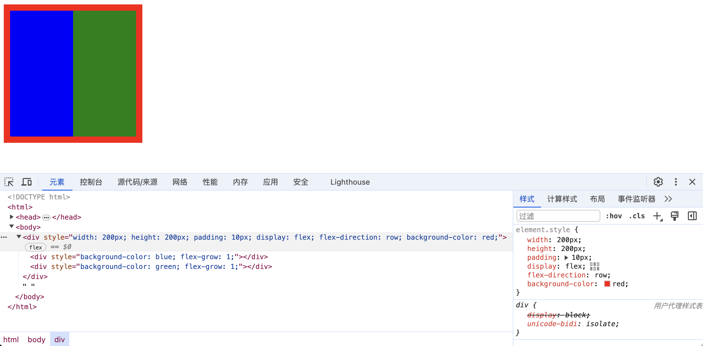

# Yoga

Yoga is an embeddable *[可嵌入的，嵌入式的]* layout system used in popular UI frameworks like React Native. 

(`Yoga` 是一个可嵌入的**布局系统**，被应用于像 `React Native` 这样的流行用户界面框架中。)

Yoga itself is not a UI framework, and does not do any drawing itself. 

(`Yoga` 本身并不是一个用户界面框架，它也不做任何绘图工作。)

Yoga's only responsibility *[责任]* is determining *[决定，确定]* the size and position of boxes.

(`Yoga` 的责任是**确定盒子的大小和位置**。)


Yoga supports a familiar *[熟悉的，常见的]* subset *[子集]* of CSS, mostly focused on Flexbox. 

(`Yoga` 支持一个常见的 `CSS` 子集，主要关注于 `Flexbox`)

This gives users a familiar model, and enables sharing code between native platforms and the browser.

(这为用户提供了一个熟悉的模型，并使得在原生平台和浏览器之间能够共享代码。)


Yoga is written in C++, with a public C API. 

(`Yoga` 是用 `C++` 编写的，并提供了一个公开的 `C` `API`。)

This allows Yoga to be used by a wide variety of languages, via both official and unofficial bindings.

(这使得 `Yoga` 能够通过官方和非官方的绑定被各种语言所使用。)


# Laying out a Yoga tree

Each box in Yoga is represented as a Yoga Node. 

(在 `Yoga` 中，每个盒子被表示为一个 `Yoga` 节点。)

These nodes form a tree which is used to store both input styles, and output layout results.

(这些节点构成了一颗树，用于存储输入样式和输出布局结果)


### Building a Yoga tree

Yoga nodes may be created, styled, and linked together.

(`Yoga` 节点可以被创建、设置样式，并且相互连接起来。)

```
const rootNode = Yoga.Node.create();
rootNode.setWidth(200);
rootNode.setHeight(200);
rootNode.setPadding(8, 10); // 设置「上下左右」内边距为10
rootNode.setDisplay(Yoga.DISPLAY_FLEX);
rootNode.setFlexDirection(Yoga.FLEX_DIRECTION_ROW);

const boxNode1 = Yoga.Node.create();
boxNode1.setFlexGrow(1);
rootNode.insertChild(boxNode1, 0);

const boxNode2 = Yoga.Node.create();
boxNode2.setFlexGrow(1);
rootNode.insertChild(boxNode2, 1);
```


### Laying out the tree

The full tree of Yoga nodes is laid out all at once.

(整个 `Yoga` 树是一次性布局完成的)

This layout may be constrained to *[表示在某种程度、范围或条件下受到限制]* a passed `availableWidth` and `availableHeight`, or may be allowed to expand *[扩大，扩展]* infinitely *[无限地]* in a given axis *[轴，轴线]* by passing `Undefined`.

(这个布局可能受到传递的 `availableWidth`（可用宽度）和 `availableHeight`（可用高度）的限制，或者通过传递 `Undefined`，可以允许在给定轴上无限扩展。)

```
rootNode.calculateLayout(200, 200, Yoga.DIRECTION_LTR);
```


### Reading layout results

```
const root = document.createElement('div');
root.style.width = `${rootNode.getComputedWidth()}px`
root.style.height = `${rootNode.getComputedHeight()}px`
root.style.padding = `${rootNode.getPadding(8).value}px`
// 获取到的是枚举值，需要转换
root.style.display = yogaDisplayToCss(rootNode.getDisplay()); 
// 获取到的是枚举值，需要转换
root.style.flexDirection = yogaFlexDirectionToCss(rootNode.getFlexDirection());
root.style.backgroundColor = 'red';

const box1 = document.createElement('div');
box1.style.backgroundColor = 'blue';
box1.style.flexGrow = boxNode1.getFlexGrow()
root.appendChild(box1)

const box2 = document.createElement('div');
box2.style.backgroundColor = 'green';
box2.style.flexGrow = boxNode2.getFlexGrow()
root.appendChild(box2)
    
document.body.appendChild(root)
```

```
// display 转换
function yogaDisplayToCss(display) {
  switch (display) {
    case 1:
      return 'none';
    case 0:
      return 'flex';
    default:
      return 'flex';
  }
}

// flexDirection 转换
function yogaFlexDirectionToCss(flexDirection) {
  switch (flexDirection) {
    case 0:
      return 'column';
    case 1:
      return 'column-reverse';
    case 2:
      return 'row';
    case 3:
      return 'row-reverse';
    default:
      return 'column';
  }
}
```

示例：

